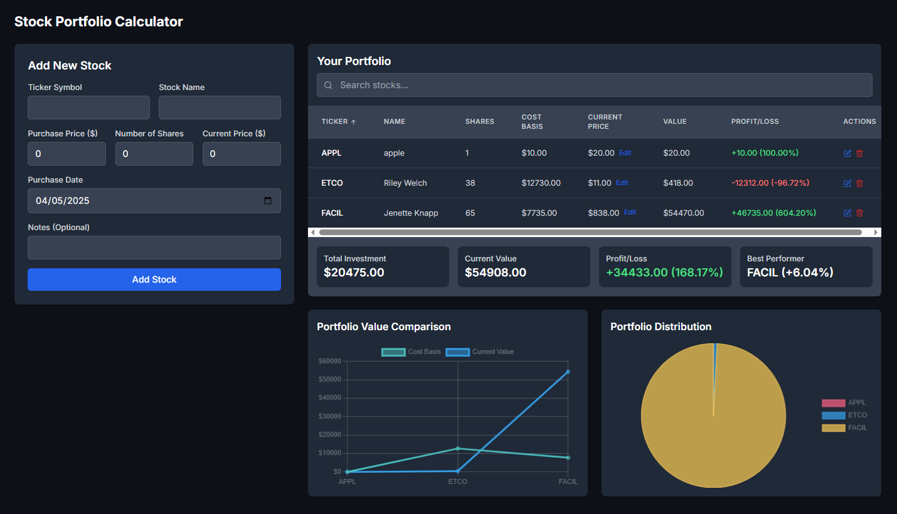

# Next.js Stock Portfolio Calculator

  

Live Demo: [stockfolio-calculator.vercel.app/](https://stockfolio-calculator.vercel.app/)

## 🚀 Features

### 📝 Portfolio Management
- Add/edit stocks with ticker symbols (e.g., AAPL), purchase price, date, and notes
- Real-time current price tracking (API-driven)
- Bulk actions to update or delete multiple stocks

### 📊 Dashboard Insights

| Metric             | Example Value     |
|--------------------|-------------------|
| Total Investment   | $20,475.00       |
| Current Value      | $54,908.00 (+168.17%) |
| Best Performer     | FACIL (+604.20%) |

### 📈 Visual Analytics
- Portfolio Distribution pie chart
- Profit/Loss Breakdown per stock (with % change)

### 🔧 Interactive UI
- Search/filter stocks
- Sort by profit, value, or ticker

## 🛠️ Tech Stack
- **Frontend:** Next.js + TypeScript
- **Styling:** Tailwind CSS
- **Deployment:** Vercel

## 🏁 Quick Start
```bash
git clone https://github.com/Alirazahaider/stock-portfolio-calculator.git
cd stock-portfolio-tracker
npm install
npm run dev
```

## 💌 Get In Touch

Thank you for checking out this project! If you have any questions, suggestions, would like to collaborate, or need my development services:

[](mailto:alicodespace@gmail.com)
[](https://www.linkedin.com/in/alirazaweb)
[](https://alicodez.vercel.app/)

⭐ Support the project by starring the repository!
[](https://github.com/Alirazahaider/stock-portfolio-calculator)
